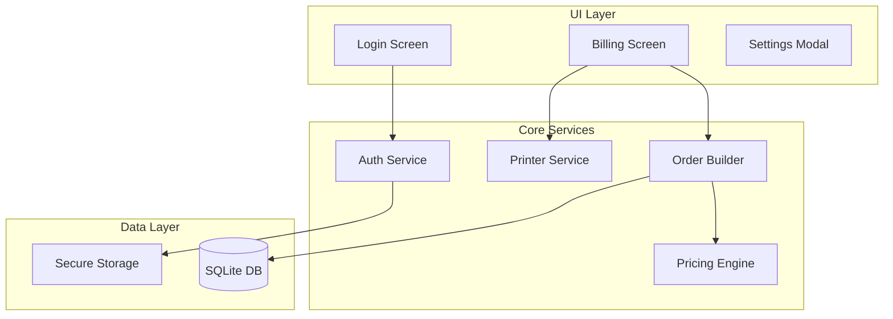

# Cafeteria & Biryani Shop Billing App - Implementation Plan

A high-speed, offline-first billing application for small to medium food outlets built with React Native (Expo), TypeScript, and SQLite.

---

## App Architecture Overview



---

## Proposed Changes

### 1. Project Setup

#### [NEW] React Native Expo Project
- Initialize with TypeScript template
- Install required dependencies:
  - `expo-sqlite` - Local database
  - `expo-secure-store` - PIN storage
  - `expo-print` - Thermal printing base
  - `react-native-esc-pos-printer` - ESC/POS protocol
  - `react-native-ble-plx` - Bluetooth connectivity

---

### 2. Folder Structure

```
src/
├── app/                    # Expo Router screens
│   ├── index.tsx           # Login screen
│   ├── billing.tsx         # Main billing screen
│   └── _layout.tsx         # Root layout
├── components/
│   ├── common/             # Reusable components
│   │   ├── Button.tsx
│   │   ├── QuantityControl.tsx
│   │   └── PriceDisplay.tsx
│   ├── billing/            # Billing-specific
│   │   ├── CategoryGrid.tsx
│   │   ├── ItemCard.tsx
│   │   ├── AddOnModal.tsx
│   │   ├── OrderSummary.tsx
│   │   └── ParcelToggle.tsx
│   └── auth/
│       └── PinPad.tsx
├── services/
│   ├── database/
│   │   ├── index.ts        # SQLite setup
│   │   ├── schema.ts       # Table definitions
│   │   └── queries.ts      # CRUD operations
│   ├── auth/
│   │   └── authService.ts
│   ├── pricing/
│   │   └── pricingEngine.ts
│   ├── order/
│   │   └── orderBuilder.ts
│   └── printer/
│       ├── printerService.ts
│       ├── escpos.ts       # ESC/POS commands
│       └── templates.ts    # Receipt templates
├── config/
│   ├── menu.ts             # Menu items & prices
│   └── constants.ts        # App constants
├── hooks/
│   ├── useDatabase.ts
│   ├── usePrinter.ts
│   └── useInactivity.ts
├── types/
│   └── index.ts            # TypeScript interfaces
└── utils/
    └── helpers.ts
```

---

### 3. Database Schema

#### [NEW] [schema.ts](file:///home/gsr/Desktop/Small_Shop_Billing_App/src/services/database/schema.ts)

```sql
-- Bills table
CREATE TABLE bills (
  id INTEGER PRIMARY KEY AUTOINCREMENT,
  bill_number TEXT UNIQUE NOT NULL,
  order_type TEXT CHECK(order_type IN ('parcel', 'dine-in')),
  items_json TEXT NOT NULL,
  subtotal REAL NOT NULL,
  total REAL NOT NULL,
  created_at TEXT DEFAULT CURRENT_TIMESTAMP
);

-- Daily counter for bill numbers
CREATE TABLE daily_counter (
  date TEXT PRIMARY KEY,
  counter INTEGER DEFAULT 0
);

-- Settings table
CREATE TABLE settings (
  key TEXT PRIMARY KEY,
  value TEXT
);
```

---

### 4. Menu Configuration

#### [NEW] [menu.ts](file:///home/gsr/Desktop/Small_Shop_Billing_App/src/config/menu.ts)

| Category | Item | Full Price | Half Price |
|----------|------|------------|------------|
| **Biryani** | Chicken Biryani | ₹180 | ₹100 |
| | Mutton Biryani | ₹250 | ₹140 |
| | Veg Biryani | ₹120 | ₹70 |
| **Beverages** | Tea | ₹15 | - |
| | Coffee | ₹20 | - |
| **Snacks** | Samosa | ₹15 | - |
| | Cutlet | ₹20 | - |

**Biryani Add-ons:**
| Add-on | Price |
|--------|-------|
| Extra Rice | ₹30 |
| Extra Chicken | ₹50 |
| Extra Mutton | ₹70 |
| Raita | ₹20 |
| Gravy | ₹25 |
| Egg | ₹15 |

---

### 5. Pricing Engine Logic

#### [NEW] [pricingEngine.ts](file:///home/gsr/Desktop/Small_Shop_Billing_App/src/services/pricing/pricingEngine.ts)

```typescript
interface OrderItem {
  id: string;
  name: string;
  category: 'biryani' | 'beverages' | 'snacks';
  portion?: 'full' | 'half';
  quantity: number;
  basePrice: number;
  addOns?: AddOn[];
}

interface AddOn {
  name: string;
  price: number;
  quantity: number;
}

function calculateItemTotal(item: OrderItem): number {
  const base = item.basePrice * item.quantity;
  const addOnTotal = item.addOns?.reduce(
    (sum, addon) => sum + addon.price * addon.quantity, 0
  ) || 0;
  return base + addOnTotal;
}

function calculateGrandTotal(items: OrderItem[]): number {
  const total = items.reduce(
    (sum, item) => sum + calculateItemTotal(item), 0
  );
  return Math.round(total); // Rounding to nearest rupee
}
```

---

### 6. Core Screens

#### [NEW] Login Screen ([index.tsx](file:///home/gsr/Desktop/Small_Shop_Billing_App/src/app/index.tsx))
- 4-digit PIN pad with large touch targets
- Auto-login check on app launch
- Vibration feedback on key press

#### [NEW] Billing Screen ([billing.tsx](file:///home/gsr/Desktop/Small_Shop_Billing_App/src/app/billing.tsx))

```
┌─────────────────────────────────────────────┐
│  BIRYANI POINT                    🖨️ ⚙️    │
├─────────────────────────────────────────────┤
│ [Beverages] [Snacks] [Biryani]              │
├─────────────────────────────────────────────┤
│ ┌─────┐ ┌─────┐ ┌─────┐ ┌─────┐             │
│ │ Tea │ │Coffee│ │ ... │ │ ... │            │
│ │ ₹15 │ │ ₹20 │ │     │ │     │             │
│ └─────┘ └─────┘ └─────┘ └─────┘             │
├─────────────────────────────────────────────┤
│ ORDER SUMMARY         [Parcel] [Dine-In]    │
│ ─────────────────────                       │
│ Tea ×2                            ₹30   [-] │
│ Chicken Biryani (Full) ×1        ₹180   [-] │
│   + Extra Chicken ×1              ₹50       │
├─────────────────────────────────────────────┤
│ TOTAL                            ₹260       │
│ ┌─────────────────────────────────────────┐ │
│ │           💵 GENERATE BILL              │ │
│ └─────────────────────────────────────────┘ │
└─────────────────────────────────────────────┘
```

---

### 7. Printer Service (ESC/POS)

#### [NEW] [printerService.ts](file:///home/gsr/Desktop/Small_Shop_Billing_App/src/services/printer/printerService.ts)

**Key Features:**
- Bluetooth device discovery and pairing
- Auto-reconnect on connection loss
- Connection status indicator in UI
- Graceful failure with local bill storage

#### [NEW] [templates.ts](file:///home/gsr/Desktop/Small_Shop_Billing_App/src/services/printer/templates.ts)

**Sample Receipt:**
```
      ╔══════════════════════╗
      ║   BIRYANI POINT     ║
      ╚══════════════════════╝
      ────────────────────────
      Chicken Biryani (Full) ×2
        + Extra Chicken ×2
      Tea ×2
      ────────────────────────
      TOTAL:              ₹420
      ────────────────────────
      Bill No: BP-20260126-001
      26/01/2026  10:30 AM
      Type: PARCEL
      ════════════════════════
        Thank You! Visit Again
```

---

### 8. Performance Optimizations

| Optimization | Implementation |
|--------------|----------------|
| Lazy loading | Load categories only when selected |
| Memoization | `React.memo` for item cards |
| Batch updates | Debounce quantity changes |
| Pre-compiled queries | SQLite prepared statements |
| Minimal re-renders | `useCallback` for handlers |

---

## Verification Plan

### Automated Testing

Since this is a new project, I'll create unit tests for critical logic:

1. **Pricing Engine Tests**
   ```bash
   npm test -- --testPathPattern=pricingEngine
   ```
   - Test add-on calculations
   - Test portion-based pricing
   - Test rounding logic

2. **Order Builder Tests**
   ```bash
   npm test -- --testPathPattern=orderBuilder
   ```
   - Test item add/remove
   - Test quantity updates
   - Test order reset

### Manual Verification

> [!IMPORTANT]
> Please verify these flows manually on your Android/iOS device:

1. **Complete Billing Flow:**
   - Add multiple items (Biryani + Tea)
   - Add add-ons to Biryani
   - Toggle Parcel/Dine-in
   - Verify total calculation
   - Submit bill and verify it saves to database

2. **Printer Test (requires Bluetooth thermal printer):**
   - Connect to printer via Bluetooth
   - Generate a test print
   - Verify receipt format

3. **Offline Functionality:**
   - Turn off internet
   - Complete a billing transaction
   - Verify data persists locally

---

## User Review Required

> [!IMPORTANT]
> **Menu Prices**: I've set placeholder prices based on typical rates. Please confirm or provide your actual menu prices before execution.

> [!WARNING]
> **Bluetooth Printer Library**: The `react-native-esc-pos-printer` library requires a development build (not Expo Go). You'll need to run `npx expo prebuild` and build a native app for printer functionality.

**Questions:**
1. What is your shop name for the receipt header?
2. Are the placeholder prices acceptable, or should I use specific values?
3. Do you have a specific Bluetooth thermal printer model?
