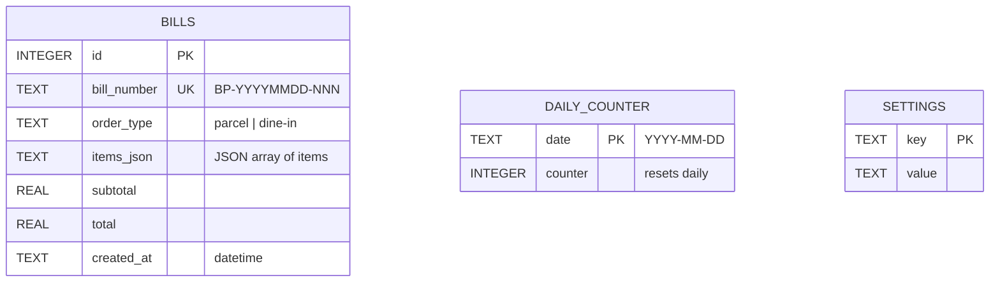
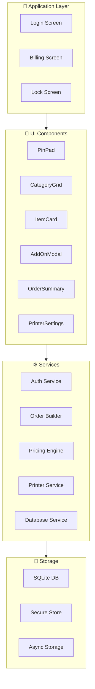

# Biryani Point Billing App - Complete Documentation

> **High-Speed, Offline-First Billing System for Food Outlets**
> 
> Built with React Native (Expo) + TypeScript + SQLite

---

## 📹 Full Application Demo


---

## 📱 Application Screens

### 1. Login Screen - PIN Authentication


**Features:**
- 4-digit PIN authentication
- Default PIN: `1234`
- Haptic feedback on button press
- Visual dots show PIN progress
- Auto-login on subsequent visits


<!-- slide -->

- **Left**: Menu items grid with large touch targets
- **Right**: Order summary with running total
- **Top**: Category tabs (Beverages, Snacks, Biryani)

---

### 3. Add-Ons Modal - Item Customization


**Features:**
- **Portion Selection**: Full (₹180) / Half (₹100)
- **Add-ons with +/- controls**:
  - Extra Rice: ₹30
  - Extra Chicken: ₹50
  - Raita: ₹20
  - Extra Gravy: ₹25
  - Egg: ₹15
- **Real-time total calculation**

---

### 4. Order Summary - Active Order


**Features:**
- Item list with quantity controls
- Remove button (✕) for each item
- Add-ons displayed under parent item
- Parcel/Dine-in toggle
- Grand total with Generate Bill button

---

### 5. Printer Settings - Bluetooth Management


**Features:**
- Connection status indicator
- Scan for nearby printers
- Signal strength display
- Connect/Disconnect controls
- Setup guide

---

### 6. Parcel Mode


---

## 🗄️ Technical Schema

### Database Schema (SQLite)



### JSON Item Schema (`items_json`)
Each item in the `items_json` array follows this structure:

```json
{
  "id": "item-id",
  "name": "Chicken Biryani",
  "quantity": 1,
  "price": 100,
  "portion": "Half",
  "addOns": [
    { "id": "extra-chicken", "name": "Extra Chicken", "price": 50, "quantity": 1 },
    { "id": "raita", "name": "Raita", "price": 20, "quantity": 1 }
  ],
  "itemTotal": 170
}
```

### Bill Number Format
```
BP-20260126-001
│   │        │
│   │        └── Daily counter (001-999)
│   └────────── Date (YYYYMMDD)
└────────────── Prefix (Biryani Point)
```

---

## 🏗️ Architecture Overview



---

## 📂 Project Structure

```
Small_Shop_Billing_App/
├── app/                          # Expo Router screens
│   ├── index.tsx                # Login screen
│   ├── billing.tsx              # Main billing screen
│   └── _layout.tsx              # Root layout
├── android/                      # Native Android (generated)
├── src/
│   ├── components/
│   │   ├── auth/
│   │   │   ├── PinPad.tsx       # Numeric keypad
│   │   │   └── LockScreen.tsx   # Inactivity lock
│   │   ├── billing/
│   │   │   ├── CategoryGrid.tsx # Category tabs
│   │   │   ├── ItemCard.tsx     # Menu item card
│   │   │   ├── AddOnModal.tsx   # Portion/add-ons
│   │   │   ├── OrderSummary.tsx # Cart panel
│   │   │   ├── ParcelToggle.tsx # Parcel/Dine-in
│   │   │   └── PrinterSettings.tsx
│   │   └── common/
│   │       ├── Button.tsx
│   │       ├── QuantityControl.tsx
│   │       └── PriceDisplay.tsx
│   ├── hooks/
│   │   ├── useInactivity.ts     # Lock timer
│   │   └── usePrinter.ts        # Bluetooth
│   ├── services/
│   │   ├── database/
│   │   │   ├── index.ts         # DB init
│   │   │   └── queries.ts       # CRUD
│   │   ├── auth/authService.ts
│   │   ├── pricing/pricingEngine.ts
│   │   ├── order/orderBuilder.ts
│   │   └── printer/
│   │       ├── printerService.ts
│   │       └── templates.ts     # ESC/POS
│   ├── config/
│   │   ├── constants.ts         # App config
│   │   └── menu.ts              # Items/prices
│   └── types/index.ts
├── app.json                      # Expo config
├── eas.json                      # Build config
└── package.json
```

---

## 📋 Menu Configuration

Edit [menu.ts](file:///home/gsr/Desktop/Small_Shop_Billing_App/src/config/menu.ts) to customize:

| Category | Items | Prices |
|----------|-------|--------|
| **Beverages** | Tea, Coffee, Cold Coffee, Lassi | ₹15-40 |
| **Snacks** | Samosa, Cutlet, Veg Puff, Pakora | ₹15-30 |
| **Biryani** | Chicken, Mutton, Veg, Egg | Full: ₹120-250, Half: ₹70-140 |

### Add-ons (Biryani only)
| Add-on | Price |
|--------|-------|
| Extra Rice | ₹30 |
| Extra Chicken | ₹50 |
| Extra Mutton | ₹70 |
| Raita | ₹20 |
| Extra Gravy | ₹25 |
| Egg | ₹15 |

---

## ⚙️ Configuration

Edit [constants.ts](file:///home/gsr/Desktop/Small_Shop_Billing_App/src/config/constants.ts):

| Setting | Default | Description |
|---------|---------|-------------|
| `APP_NAME` | Biryani Point | Shop name |
| `DEFAULT_PIN` | 1234 | Initial PIN |
| `INACTIVITY_TIMEOUT` | 5 minutes | Lock timeout |
| `BILL_PREFIX` | BP | Bill number prefix |

---

## 🔧 Build Instructions

### Development
```bash
cd /home/gsr/Desktop/Small_Shop_Billing_App
npm start
# Scan QR with Expo Go app
```

### Build APK

> [!IMPORTANT]
> Building APK requires Java JDK or EAS cloud build.

**Option 1: EAS Cloud Build (Recommended)**
```bash
# Login to Expo account
eas login

# Build APK
eas build --platform android --profile preview

# Download APK from provided URL
```

**Option 2: Local Native Build (Complete Setup)**

If you want to build the APK on your own machine, follow these precise steps:

1. **Install Java 17 (JDK)**
   ```bash
   sudo apt update
   sudo apt install openjdk-17-jdk
   ```

2. **Install Android SDK Command Line Tools**
   ```bash
   mkdir -p ~/Android/Sdk
   cd ~/Android/Sdk
   wget https://dl.google.com/android/repository/commandlinetools-linux-11076708_latest.zip -O cmdline-tools.zip
   unzip cmdline-tools.zip
   mkdir -p cmdline-tools/latest
   mv cmdline-tools/bin cmdline-tools/lib cmdline-tools/latest/
   ```

3. **Set Environment Variables**
   Add these to your `~/.bashrc` or `~/.zshrc`:
   ```bash
   export ANDROID_HOME=$HOME/Android/Sdk
   export PATH=$PATH:$ANDROID_HOME/cmdline-tools/latest/bin
   export PATH=$PATH:$ANDROID_HOME/platform-tools
   ```

4. **Install Required SDK Components**
   ```bash
   yes | sdkmanager --licenses
   sdkmanager "platform-tools" "platforms;android-34" "build-tools;34.0.0"
   ```

5. **Generate the APK**
   ```bash
   cd /home/gsr/Desktop/Small_Shop_Billing_App/android
   ./gradlew assembleRelease
   ```

6. **Output Location**
   The generated APK is located at:
   `android/app/build/outputs/apk/release/app-release.apk`


---

## 🖨️ ESC/POS Receipt Sample

```
════════════════════════════════
         BIRYANI POINT
════════════════════════════════
Chicken Biryani (Half)   ×1  ₹100
  + Extra Chicken
  + Raita
Tea                      ×2   ₹30
────────────────────────────────
                  TOTAL: ₹170
────────────────────────────────
Bill No: BP-20260126-001
26/01/2026  11:00 AM
        [ PARCEL ]
════════════════════════════════
     Thank You! Visit Again
```

---

## ✅ Complete Feature List

| Feature | Status |
|---------|--------|
| PIN-based login | ✅ |
| Auto-login | ✅ |
| Inactivity lock (5 min) | ✅ |
| Category tabs | ✅ |
| Item selection | ✅ |
| Portion types | ✅ |
| Add-ons system | ✅ |
| Quantity controls | ✅ |
| Long-press rapid increment | ✅ |
| Parcel/Dine-in toggle | ✅ |
| Real-time pricing | ✅ |
| SQLite offline storage | ✅ |
| Unique bill numbering | ✅ |
| Daily counter reset | ✅ |
| Bluetooth printer discovery | ✅ |
| Auto-reconnect (3 attempts) | ✅ |
| Saved printer persistence | ✅ |
| ESC/POS templates | ✅ |
| Dark mode UI | ✅ |
| Tablet layout support | ✅ |
| EAS build config | ✅ |

echo "sdk.dir=/home/gsr/Android/Sdk" > android/local.properties && cd android && ./gradlew assembleRelease


